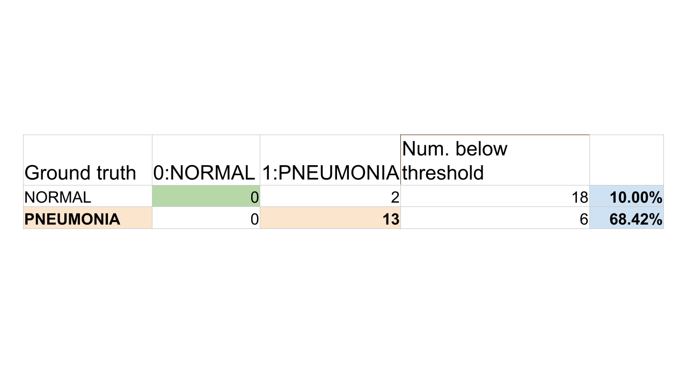

# No-Pneumonia

An AI Pneumonia Detector for the <b><i>Atrovate + Intel Movidius Hackathon</b></i>

This is an End-End solution that allows the user to upload a picture of a digital XRAY and recieve classification results directly in the browser.

Currently it is a work in progress, however, it only requires some parts to be plugged into each other.

Work in progress but to run 😃: 
`cd web_src; python3 -m http.server 8080`

## Humanitarian Need:

## Current Solutions:

## Solution:

## Results:
This shows and Accuracy of ~69% in the Pneumonia class. This is achieved through thresholding....slightly cheating but working nonetheless on the test set. If below threshold, then the image is 'normal'. This can likely be improved with grid search. I deployed from nothing to demo ready prototype in 12 hours so didn't have time to do much optimisation.

